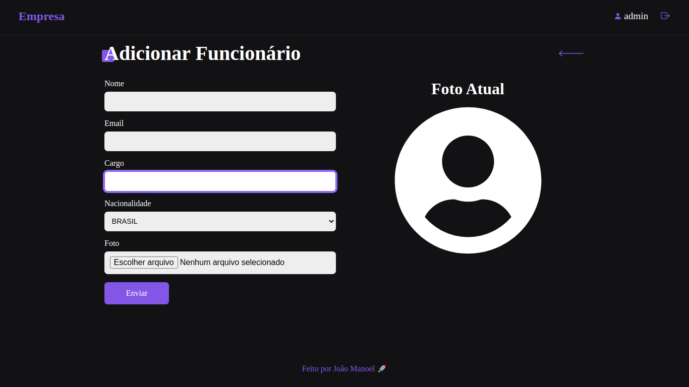
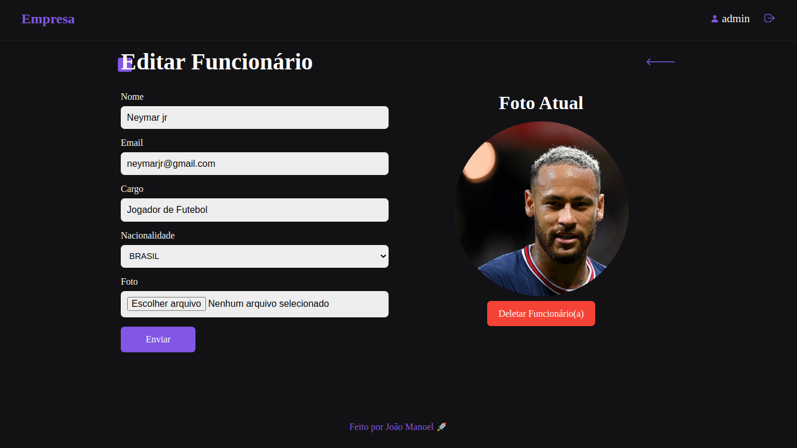
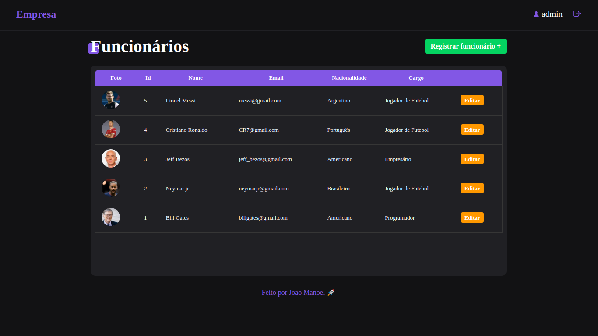
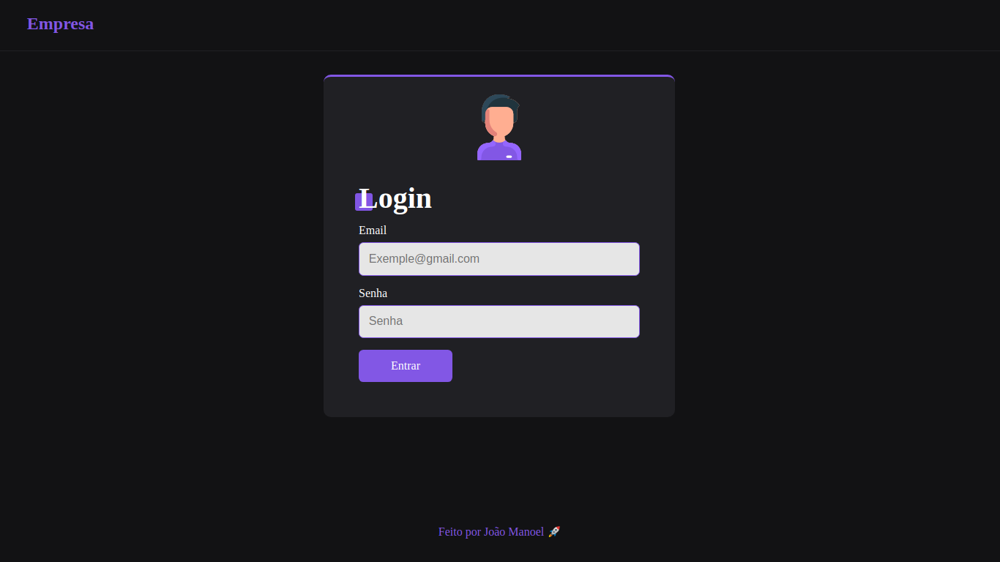

# User_Control

## :dart: Sobre ##

O projeto User_Control é um sistema de controle de usuários feito para praticar conhecimentos adquiridos em NodeJS e ReactJS.

## :rocket: Tecnologias ##

As seguintes tecnologias foram utilizadas no projeto:

- [React.js](https://reactjs.org/)
- [Node.js](https://nodejs.org/en/)


## :white_check_mark: Requerimentos ##

- [Node](https://nodejs.org/en/)
- [Yarn](https://yarnpkg.com/lang/en/)

## :checkered_flag: Começando ##

```bash
# Clone this project
$ git clone git@github.com:JoaoManoelDev/user_control.git

# Access
$ cd user_control/api

# Install dependencies
$ yarn

# You must create a .env file inside the api folder,
# create a variable called TOKEN_SECRET and assign any value to it

# Run the project
$ yarn dev

# The server will initialize in the <http://localhost:3333>

# In another terminal access
$ cd user_control/web

# Install dependencies
$ yarn

# Run the project
$ yarn start

# The web will initialize in the <http://localhost:3000>

# The app will provide an email and a password for tests which will
# be created automatically by the sequelize seeds
# email: admin@gmail.com
# password: 91217571

```

## :framed_picture: Web app ##

<div align="center">
  <h2 align="left" >Create</h2>
    
  <h2 align="left" >Edit</h2>
    
  <h2 align="left" >Home Page</h2>
    
  <h2 align="left" >Login</h2>
    
</div>

